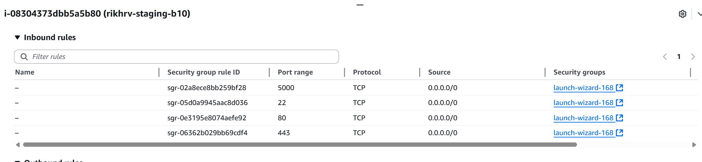
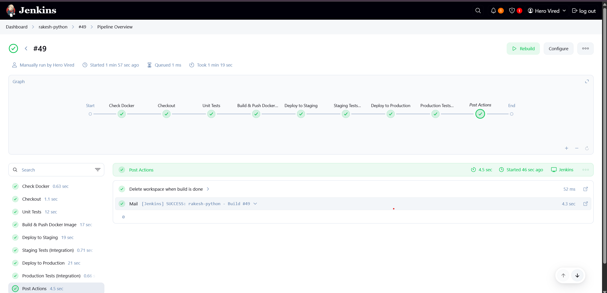
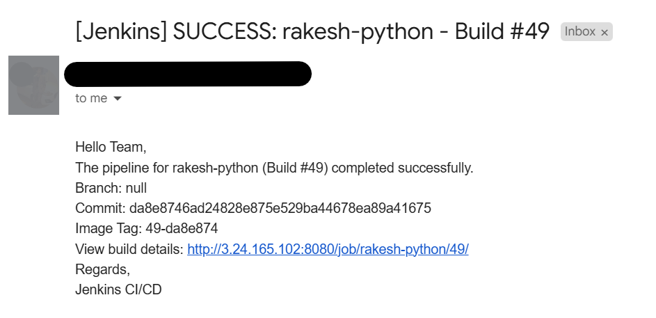
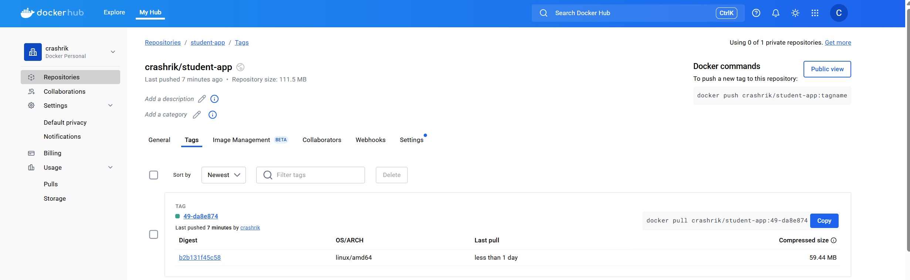
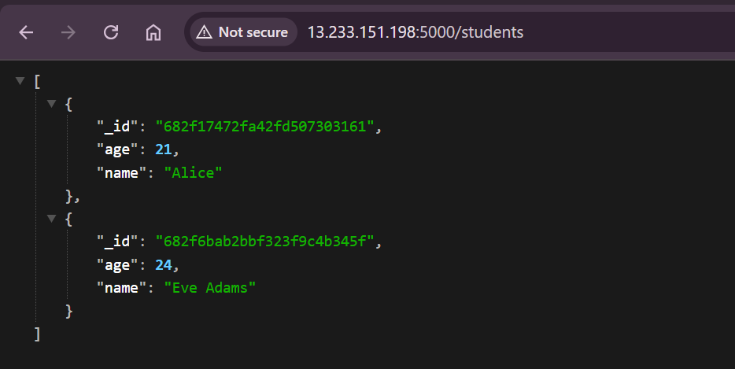
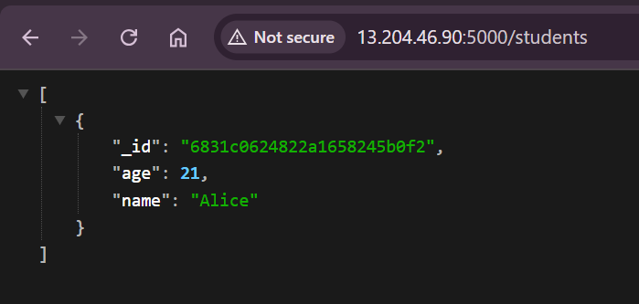
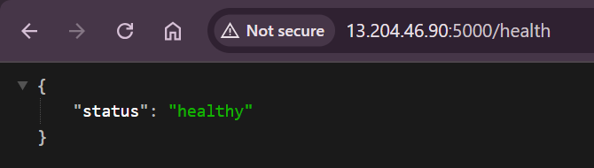
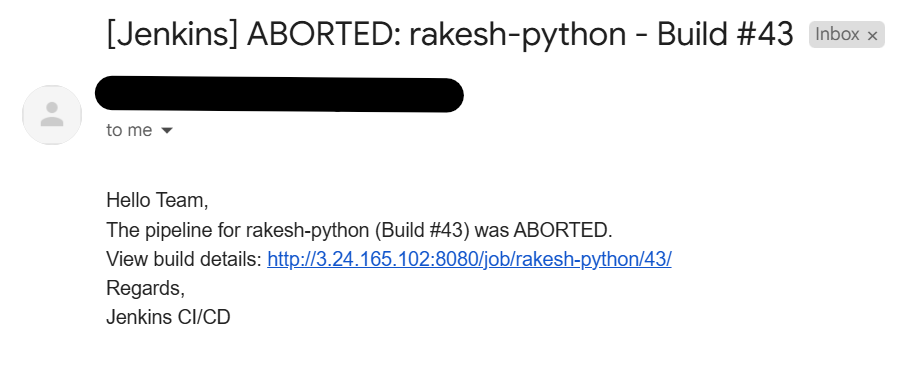
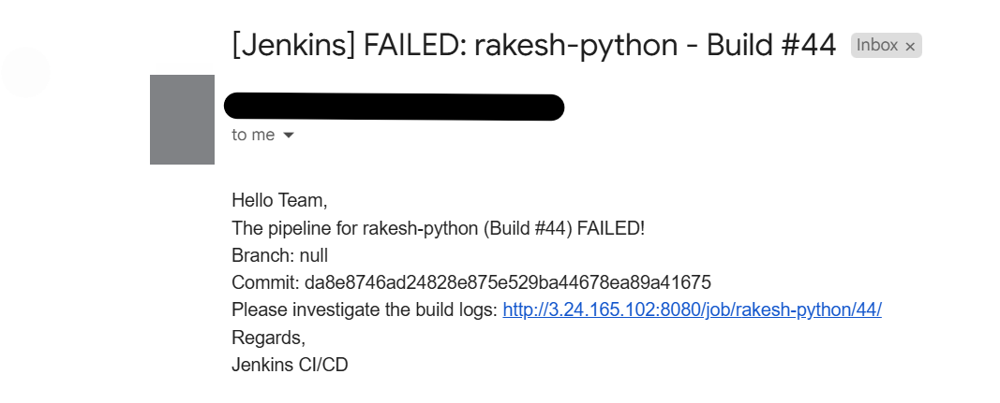

## Pre-Requisite  

- Set up 2 EC2 instance one for staging and one for production and ensure ```5000``` port is exposed to ```0.0.0.0```


- ```Jenkinsfile``` contains the script which will explain the detailed stages and steps to executed 
    - ensure ```environment``` block will be filled with all required details for the pipeline as well for Flask App like ```AWS SSH Credentials ``` & ```Docker hub Credentials```
    - Below steps needs to be followed  for Email configuration 
    -Install Plugins:
        - Email Extension Plugin
        - Email Extension Template Plugin
        - Pipeline: GitHub (for commit tracking)
    - Configure System Settings:
    ```bash
    -Manage Jenkins → Configure System → Email Notification
    -SMTP server: smtp.gmail.com
    -SMTP Port: 587
    -Use SSL: ✔️
    -Use TLS: ✔️
    -Credentials: Add your email/password
    ```

## Jenkins CI/CD in action 

- Automatic build was triggered based on ```SCM polling```
- Build was successful

- Emails also been triggered to intended recipients 

- Docker Repo have latest build 

- Staging environment is up and running 

- Production envionment is up and running 



### ***NOTE***
- Simulate few builds for ```abort``` and ```failed``` emails with their respective email has been received.
    - abort
     
    - failed 
     