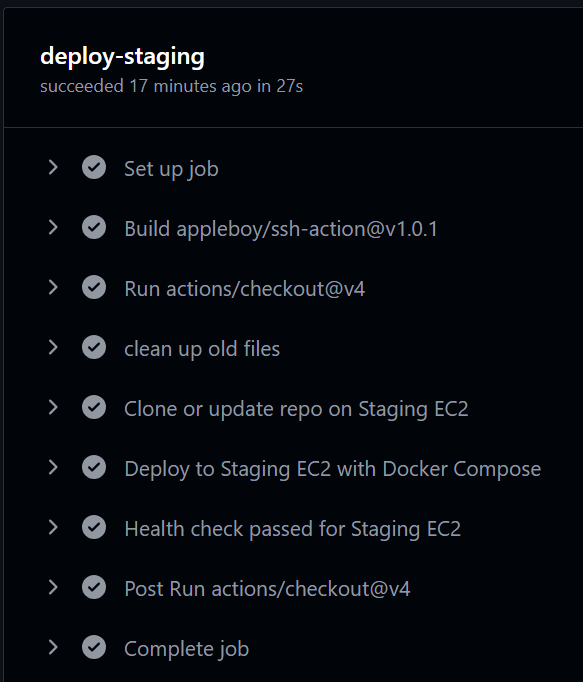

## Pre-Requisites

- Create `.github/workflows/ci-cd.yml`.
- Generate a Personal Access Token (PAT) for the repository:  
  Go to **User Profile → Settings → Developer Settings → Personal access tokens (classic)**.
- Add the required secret key in the repository:  
  Navigate to **Settings → Secrets and variables → Actions**.
- Ensure your EC2 instance is set up with `docker`, `docker-compose`, and `git` installed.

## GitHub Actions Workflow Overview

- The `deploy-staging` job is triggered after a successful `build`.  
  The `build` job depends on passing unit tests (`run-tests`) for the Flask application using pytest.  
  All these cycles runs on every push or pull request to the `main` branch.
- After `deploy-staging` completes, `deploy-production` is triggered automatically on a Git `release` event.

---

### 1. EC2 Instances

Amazon EC2 instances are running:


| Environment  | Name             | Public IP Address   |
| :----------- | :--------------- | :----------------- |
| `Staging`    | rikhrv-staging   | 43.204.217.164     |
| `Production` | rikhrv-Prod      | 3.110.84.63        |

---

### 2. EC2 Staging Environment Deployment

- **Install dependencies:**  
  
- **Run tests:**  
  
- **Build Docker image:**  
    
  
- **Deploy to staging:**  
  
- **Deployment pipeline success:**  
  

> **NOTE:**  
> Staging Environment is running:  
>   
>   
> 

---

### 3. Production Environment Deployment

Once the `deploy-staging` job completes successfully and a Git `release` event occurs, the `deploy-production` workflow is triggered automatically.

- The GitHub Actions workflow completes the deployment to the production environment.

> **NOTE:**  
> The Production Environment is now running:  
>   
> 
>
> **Test the POST endpoint:**  
> Use the following `curl` command to test the API:
> ```bash
> curl -X POST -H "Content-Type: application/json" -d '{"name": "Eve Adams", "age": 24}' http://3.110.84.63:5000/students
> ```
>   
> 